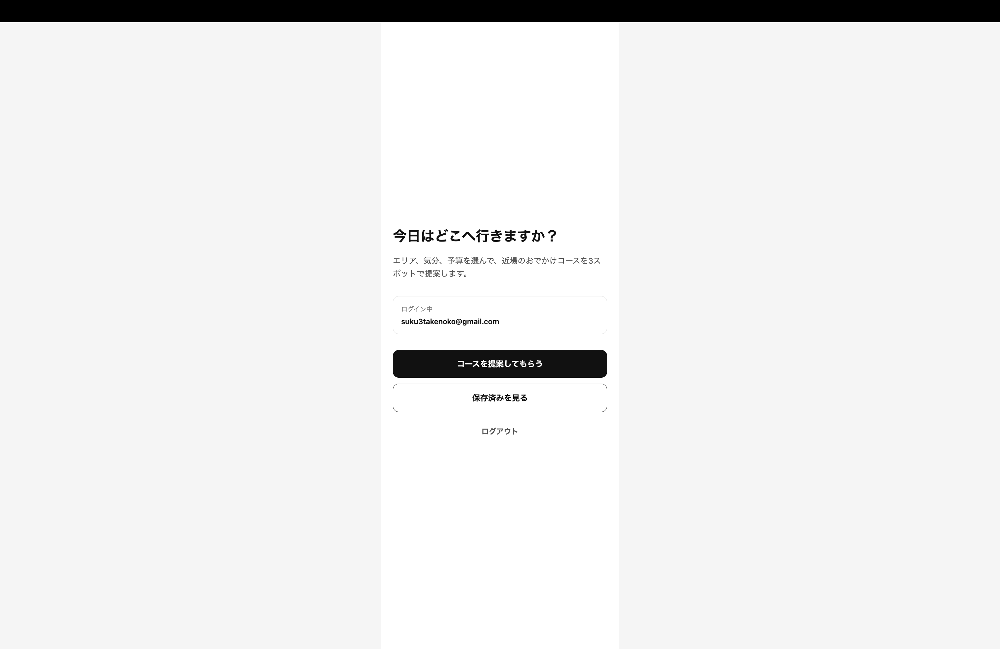
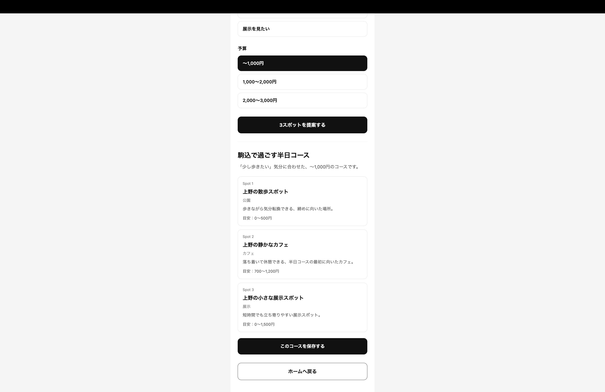
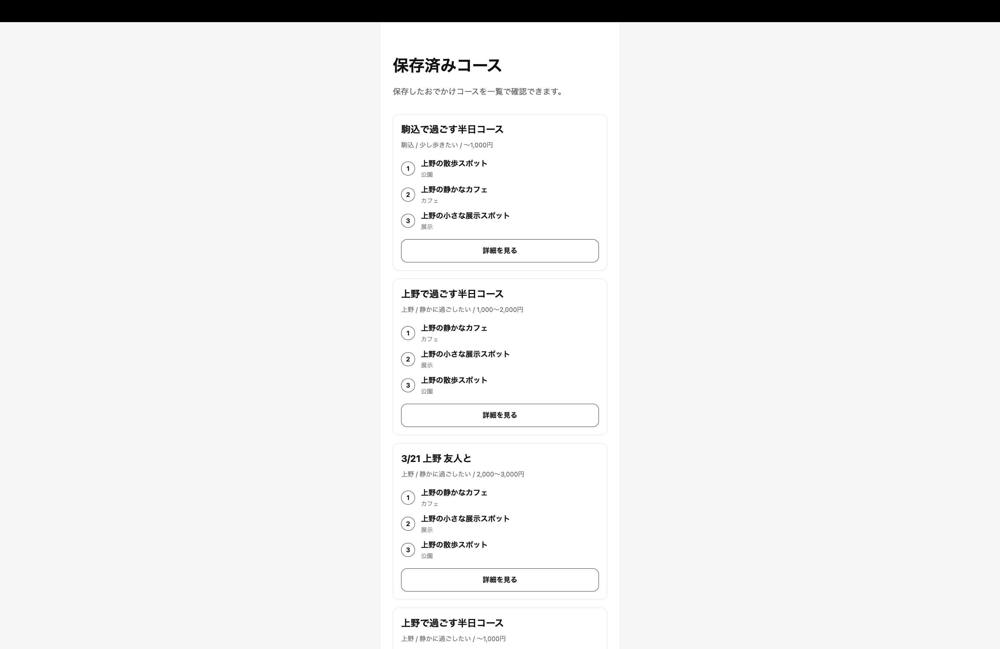
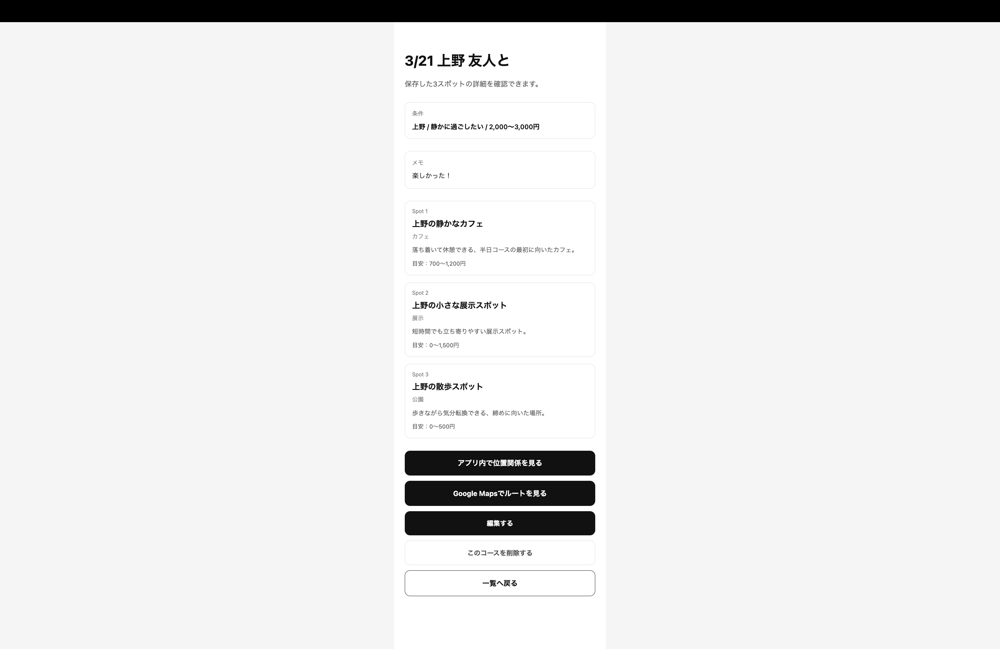
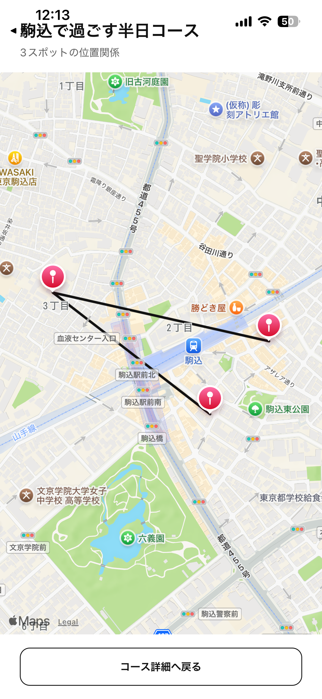

# Odango

Odangoは、休日や空き時間に「どこへ行くか」を決める負担を減らすための、おでかけコース提案・保存アプリです。

ユーザーがエリア・気分・予算を選ぶと、近場で回りやすい3スポットのコースを提案し、保存済みコースとして後から見返せます。

提案された3スポットは、アプリ内の地図またはGoogle Mapsで位置関係を確認できます。

## コンセプト

既存のおでかけ・旅行系サービスは、多くの候補や詳細な旅行計画を扱うものが多く、日常の軽い外出では情報量が多すぎて迷いやすいと感じました。

Odangoでは、あえて「3スポット」に絞ることで、選択肢を増やすのではなく、選択肢をちょうどよく減らす体験を目指しています。

## 主な機能

- メールアドレスとパスワードによる新規登録
- ログイン / ログアウト
- 未ログインユーザーのアクセス制御
- エリア・気分・予算によるスポット提案
- Supabase上のスポットデータ取得
- 3スポットのおでかけコース保存
- 保存済みコース一覧表示
- 保存済みコース詳細表示
- コースタイトル・メモの編集
- 保存済みコースの削除
- アプリ内地図で3スポットの位置関係を表示
- 3スポットを訪問順にマーカーと線で表示
- Google Mapsで3スポットの徒歩ルートを表示
- ユーザーごとのデータ分離
- Supabase Row Level Securityによる認可制御

## 技術スタック

| 領域           | 使用技術                    |
| -------------- | --------------------------- |
| フロントエンド | React Native / Expo SDK 54  |
| 言語           | TypeScript                  |
| ルーティング   | Expo Router                 |
| 認証           | Supabase Auth               |
| データベース   | Supabase PostgreSQL         |
| 権限制御       | Supabase Row Level Security |
| 地図表示       | react-native-maps           |
| 外部地図連携   | Google Maps URLs            |
| 状態管理       | React Hooks                 |
| バージョン管理 | Git / GitHub                |

## 画面構成

```text
/
├── login
├── signup
├── home
├── suggest
└── courses
    ├── index
    └── [id]
        ├── index
        ├── edit
        └── map
```

## データベース設計

### spots

おでかけ先のマスターデータです。

| カラム          | 内容            |
| --------------- | --------------- |
| id              | スポットID      |
| name            | スポット名      |
| area            | エリア          |
| mood            | 気分カテゴリ    |
| category        | カテゴリ        |
| description     | 説明            |
| budget_min      | 目安予算の下限  |
| budget_max      | 目安予算の上限  |
| google_maps_url | Google Maps URL |
| latitude        | 緯度            |
| longitude       | 経度            |
| created_at      | 作成日時        |

### courses

ユーザーが保存したおでかけコース本体です。

| カラム       | 内容       |
| ------------ | ---------- |
| id           | コースID   |
| user_id      | ユーザーID |
| title        | コース名   |
| area         | エリア     |
| mood         | 気分       |
| budget_label | 予算ラベル |
| memo         | メモ       |
| created_at   | 作成日時   |
| updated_at   | 更新日時   |

### course_spots

コースとスポットを紐づける中間テーブルです。

| カラム     | 内容               |
| ---------- | ------------------ |
| id         | ID                 |
| course_id  | コースID           |
| spot_id    | スポットID         |
| position   | 訪問順             |
| note       | スポットごとのメモ |
| created_at | 作成日時           |

## 認可設計

Odangoでは、Supabase AuthのユーザーIDと `courses.user_id` を紐づけています。

Supabase Row Level Securityを用いて、各ユーザーは自分が作成したコースのみ閲覧・編集・削除できるようにしています。

`course_spots` は直接 `user_id` を持たず、紐づく `courses` を経由して所有者を判定しています。これにより、コース本体だけでなく、コースに含まれるスポットの並びもユーザーごとに保護しています。

## 地図機能

各スポットには緯度・経度を保持し、保存した3スポットを訪問順に地図上へ表示しています。

モバイル版では、`react-native-maps`を利用して次の情報を表示します。

- 3スポットのマーカー
- 訪問順
- スポット名とカテゴリ
- 1番目から3番目までを結ぶ線

また、Google Maps URLsを生成し、3スポットを経由する徒歩ルートを外部のGoogle Mapsで開けるようにしています。

現在、アプリ内地図で表示している線は、道路に沿った経路ではなく、各スポットの座標を訪問順に結んだ直線です。実際の徒歩経路・距離・所要時間は、今後Google Routes APIを利用して取得する予定です。

## 実装上の工夫

- 旅行計画全体ではなく、日常の半日おでかけにスコープを絞った
- 3スポット提案に限定し、意思決定の負担を下げた
- スポットマスターと保存済みコースを分離し、同じスポットを複数コースで再利用できる設計にした
- `course_spots.position` により、スポットの訪問順を管理できるようにした
- Supabase RLSにより、フロント側だけでなくDB側でもデータアクセスを制御した
- 緯度・経度をスポットデータに持たせ、地図表示や今後の距離計算に拡張できる構成にした
- Google Maps URLsを利用し、APIキーなしで3地点の徒歩ルートを確認できるようにした
- Webとモバイルで地図表示方法を分け、モバイルではアプリ内地図、WebではGoogle Mapsへの導線を表示した
- `AppButton`などの共通コンポーネントを作成し、ボタンの見た目と動作を統一した
- まずMVPを優先し、推薦最適化や道路に沿った経路取得を後から追加できる構成にした

## サンプルデータについて

現在登録しているスポット名、説明、緯度・経度は、機能検証用のサンプルデータです。

地図表示とルート表示の動作を確認するため、上野・池袋・清澄白河・駒込周辺のダミー座標を登録しています。今後、実在するスポット情報へ置き換える予定です。

## セットアップ

### 1. リポジトリをクローン

```bash
git clone https://github.com/tyokubo/odango.git
cd odango
```

### 2. パッケージをインストール

```bash
npm install
```

### 3. 環境変数を設定

`.env.example` を参考に、`.env` を作成します。

```env
EXPO_PUBLIC_SUPABASE_URL=your-supabase-url
EXPO_PUBLIC_SUPABASE_ANON_KEY=your-supabase-anon-key
```

`.env`はGit管理に含めないでください。

### 4. 開発サーバーを起動

```bash
npx expo start
```

スマートフォンでは、Expo Goで表示されたQRコードを読み取ります。

Webで確認する場合は、以下を実行します。

```bash
npx expo start --web
```

キャッシュを削除して起動する場合は、以下を実行します。

```bash
npx expo start --clear
```

## 現在の実装状況

- 認証機能：実装済み
- スポット提案：実装済み
- コース保存：実装済み
- 保存済み一覧：実装済み
- 詳細表示：実装済み
- 編集：実装済み
- 削除：実装済み
- RLSによるユーザーごとのデータ制御：実装済み
- Google Mapsでの徒歩ルート表示：実装済み
- アプリ内での3地点マーカー表示：実装済み
- 3地点を訪問順に結ぶ直線表示：実装済み
- Web表示時の代替導線：実装済み
- UIコンポーネントの共通化：一部実装済み
- Google Routes APIによる徒歩距離・所要時間取得：未実装
- 道路に沿った経路表示：未実装
- おすすめロジックの最適化：未実装
- デモ動画：未作成

## 今後の改善予定

### 地図・ルート機能

- Google Routes APIの導入
- Supabase Edge Functionsを利用したAPIキーの安全な管理
- 道路に沿った徒歩経路の表示
- 3スポット間の徒歩距離と所要時間の表示
- 回りやすい訪問順の計算

### おすすめ機能

- 気分・予算・カテゴリを用いたスコアリング
- 同じカテゴリのスポットが重複しすぎない選択処理
- 緯度・経度を利用した距離評価
- 距離とカテゴリの多様性を考慮した3スポット選択
- スポットデータの拡充

### UI・操作性

- UIコンポーネントの共通化
- ローディング・エラー表示の整理
- コース詳細画面のタイムライン表示
- スポットカードの表示アニメーション
- ボタン操作時のアニメーション
- 画面遷移時の動きの追加
- 保存済みコースの検索・絞り込み

### ポートフォリオ

- 地図画面のスクリーンショット追加
- デモ動画作成
- 実在スポットデータへの置き換え

## スクリーンショット

以下は開発中の仮UIです。

現在はMVP機能、認証・DB・RLS、地図表示の動作確認を優先しており、今後UIコンポーネントの共通化、余白調整、アニメーションの追加を行う予定です。

また、現在表示しているスポット名と位置情報は、機能検証用のサンプルデータです。

### トップ画面



### ログイン画面


### コース提案画面



### 保存済みコース一覧



### コース詳細画面



### コース地図画面


※Google Mapに移動してルートを見ることも可能です。
