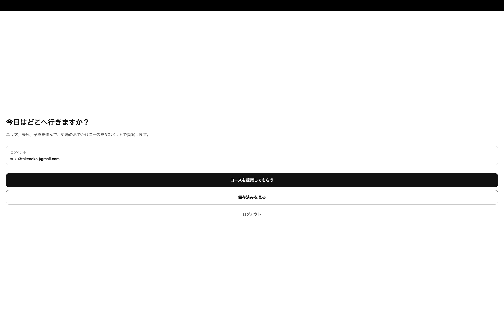
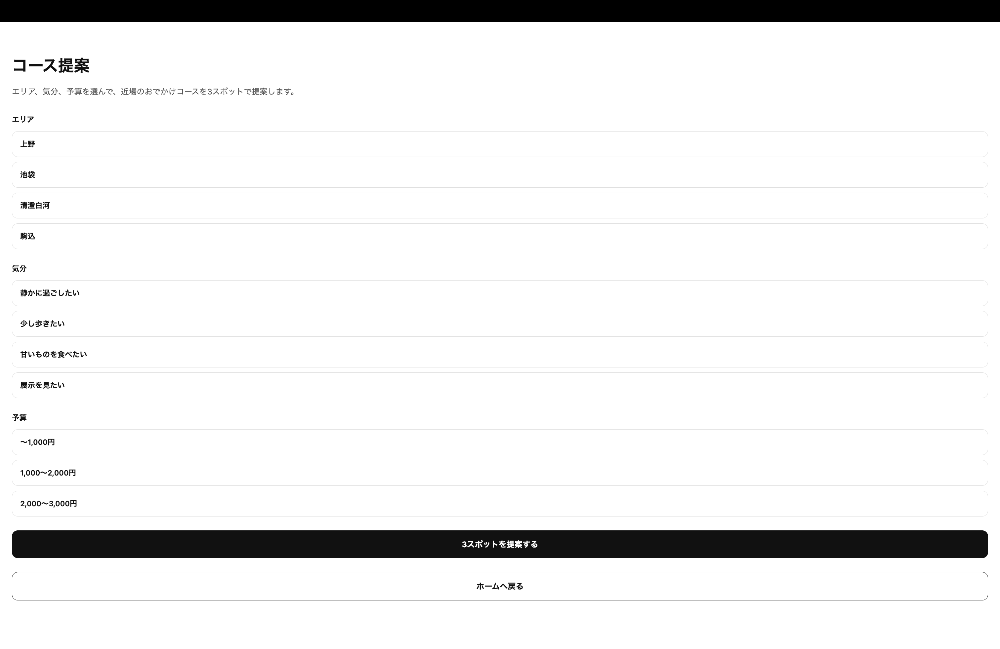
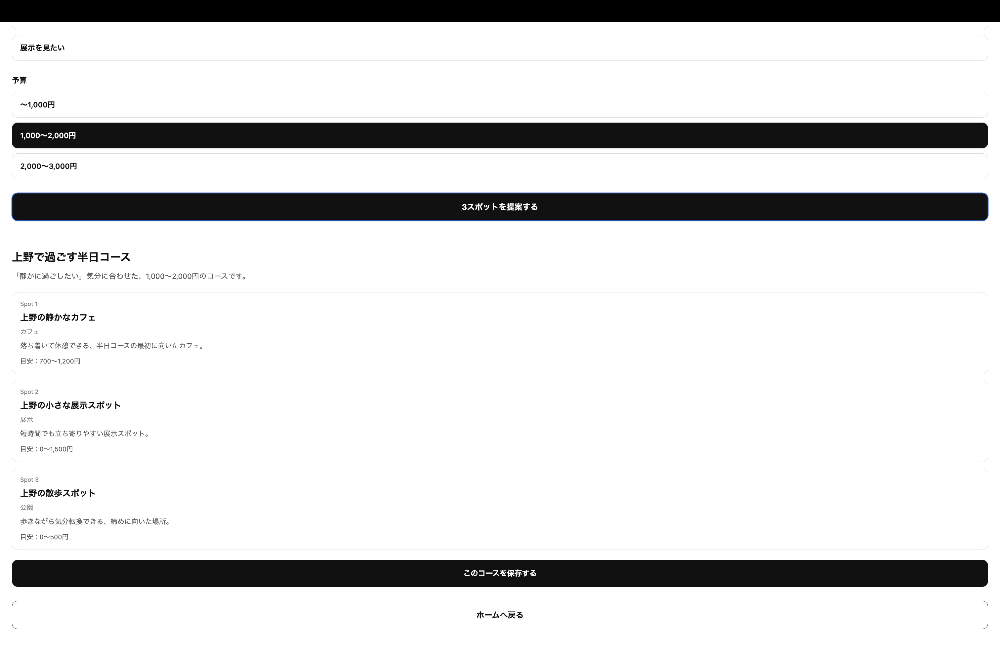
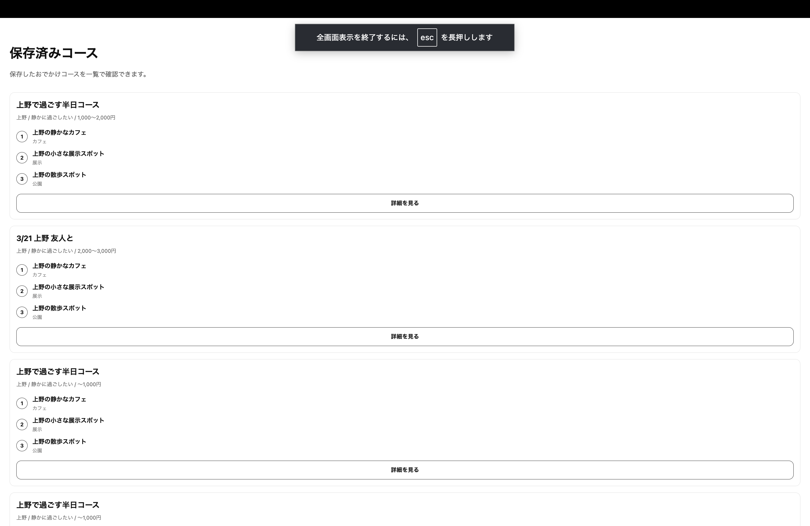
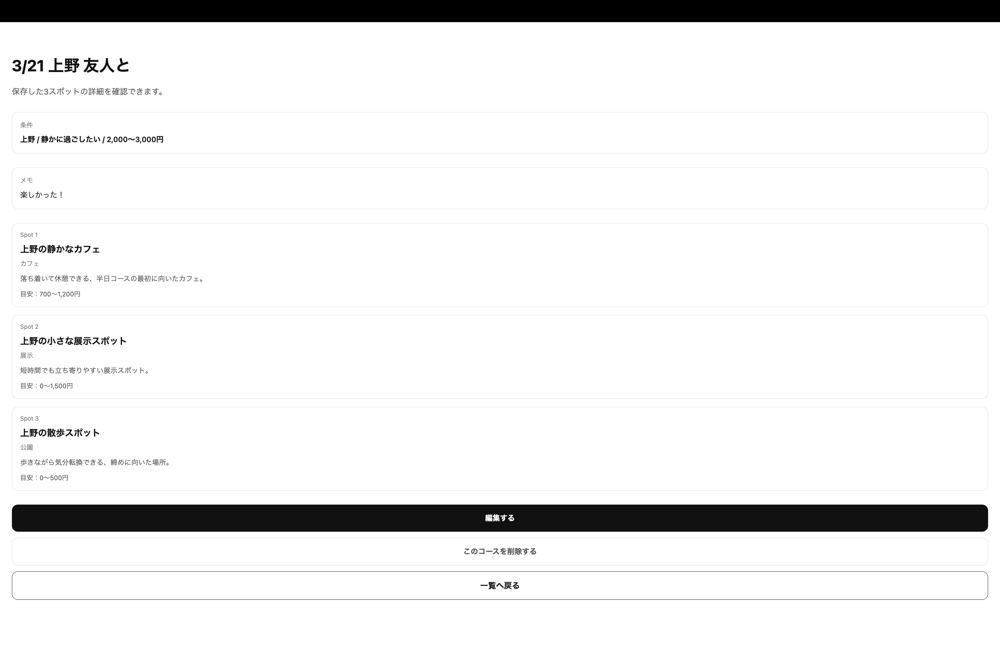

# Odango

Odangoは、休日や空き時間に「どこへ行くか」を決める負担を減らすための、おでかけコース提案・保存アプリです。

ユーザーがエリア・気分・予算を選ぶと、近場で回りやすい3スポットのコースを提案し、保存済みコースとして後から見返せます。

## コンセプト

既存のおでかけ・旅行系サービスは、多くの候補や詳細な旅行計画を扱うものが多く、日常の軽い外出では情報量が多すぎて迷いやすいと感じました。

Odangoでは、あえて「3スポット」に絞ることで、選択肢を増やすのではなく、選択肢をちょうどよく減らす体験を目指しています。

## 主な機能

* メールアドレスとパスワードによる新規登録
* ログイン / ログアウト
* 未ログインユーザーのアクセス制御
* エリア・気分・予算によるスポット提案
* Supabase上のスポットデータ取得
* 3スポットのおでかけコース保存
* 保存済みコース一覧表示
* 保存済みコース詳細表示
* コースタイトル・メモの編集
* 保存済みコースの削除
* ユーザーごとのデータ分離
* Supabase Row Level Securityによる認可制御

## 技術スタック

| 領域      | 使用技術                        |
| ------- | --------------------------- |
| フロントエンド | React Native / Expo         |
| 言語      | TypeScript                  |
| ルーティング  | Expo Router                 |
| 認証      | Supabase Auth               |
| データベース  | Supabase PostgreSQL         |
| 権限制御    | Supabase Row Level Security |
| 状態管理    | React Hooks                 |
| バージョン管理 | Git / GitHub                |

## 画面構成

```text
/
├── login
├── signup
├── home
├── suggest
└── courses
    └── [id]
        └── edit
```

## データベース設計

### spots

おでかけ先のマスターデータです。

| カラム             | 内容              |
| --------------- | --------------- |
| id              | スポットID          |
| name            | スポット名           |
| area            | エリア             |
| mood            | 気分カテゴリ          |
| category        | カテゴリ            |
| description     | 説明              |
| budget_min      | 目安予算の下限         |
| budget_max      | 目安予算の上限         |
| google_maps_url | Google Maps URL |
| created_at      | 作成日時            |

### courses

ユーザーが保存したおでかけコース本体です。

| カラム          | 内容     |
| ------------ | ------ |
| id           | コースID  |
| user_id      | ユーザーID |
| title        | コース名   |
| area         | エリア    |
| mood         | 気分     |
| budget_label | 予算ラベル  |
| memo         | メモ     |
| created_at   | 作成日時   |
| updated_at   | 更新日時   |

### course_spots

コースとスポットを紐づける中間テーブルです。

| カラム        | 内容        |
| ---------- | --------- |
| id         | ID        |
| course_id  | コースID     |
| spot_id    | スポットID    |
| position   | 訪問順       |
| note       | スポットごとのメモ |
| created_at | 作成日時      |

## 認可設計

Odangoでは、Supabase AuthのユーザーIDと `courses.user_id` を紐づけています。

Supabase Row Level Securityを用いて、各ユーザーは自分が作成したコースのみ閲覧・編集・削除できるようにしています。

`course_spots` は直接 `user_id` を持たず、紐づく `courses` を経由して所有者を判定しています。これにより、コース本体だけでなく、コースに含まれるスポットの並びもユーザーごとに保護しています。

## 実装上の工夫

* 旅行計画全体ではなく、日常の半日おでかけにスコープを絞った
* 3スポット提案に限定し、意思決定の負担を下げた
* スポットマスターと保存済みコースを分離し、同じスポットを複数コースで再利用できる設計にした
* `course_spots.position` により、スポットの訪問順を管理できるようにした
* Supabase RLSにより、フロント側だけでなくDB側でもデータアクセスを制御した
* まずMVPを優先し、地図APIやAI推薦は後から拡張できる構成にした

## セットアップ

### 1. リポジトリをクローン

```bash
git clone <repository-url>
cd odango
```

### 2. パッケージをインストール

```bash
npm install
```

### 3. 環境変数を設定

`.env.example` を参考に、`.env` を作成します。

```env
EXPO_PUBLIC_SUPABASE_URL=your-supabase-url
EXPO_PUBLIC_SUPABASE_ANON_KEY=your-supabase-anon-key
```

`.env` はGit管理に含めないでください。

### 4. 開発サーバーを起動

```bash
npx expo start
```

Webで確認する場合は以下を実行します。

```bash
npx expo start --web
```

## 現在の実装状況

* 認証機能：実装済み
* スポット提案：実装済み
* コース保存：実装済み
* 保存済み一覧：実装済み
* 詳細表示：実装済み
* 編集：実装済み
* 削除：実装済み
* RLSによるユーザーごとのデータ制御：実装済み
* UI共通化：一部未対応
* デモ動画：未作成

## 今後の改善予定

* UIコンポーネントの共通化
* ローディング・エラー表示の整理
* 保存済みコースの検索・絞り込み
* Google Mapsリンクの追加
* スポットデータの拡充
* デモ動画作成
* READMEへのスクリーンショット追加

## スクリーンショット

以下は開発中の仮UIです。  
現在はMVP機能の実装確認を優先しており、今後UIコンポーネントの共通化、余白調整、スクリーンごとの表示改善を行う予定です。

### トップ画面



### ログイン画面


### コース提案画面




### 保存済みコース一覧



### コース詳細画面


